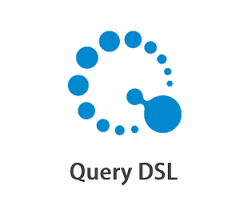
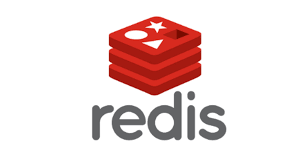
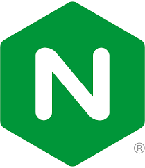
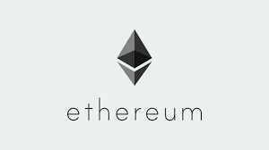
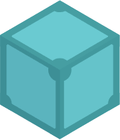
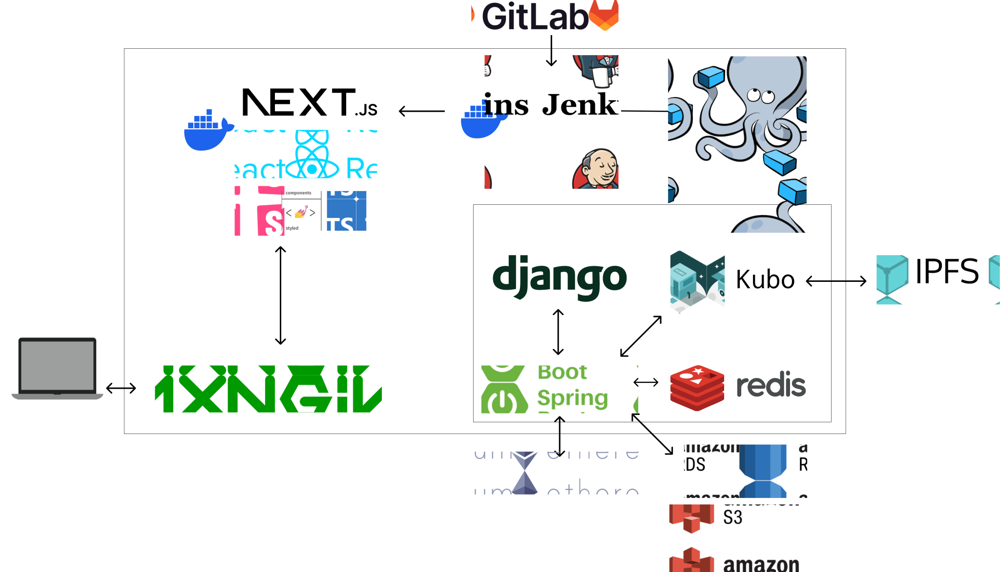
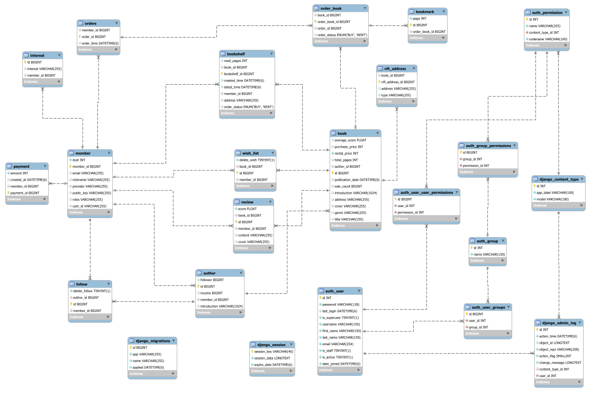

   

  

   

## 목차
1. [**서비스 소개**](#1)
2. [**프로젝트 일정**](#2)
3. [**팀원 소개**](#3)
4. [**기술 스택**](#4)
5. [**시스템 구성도**](#5)
6. [**주요 기능**](#6)

## 💡 서비스 소개

### 방글

### 방에서 쓴 글이 모두의 블록 안으로

> 독립출판물을 위한 전자 서점 방글에서는  
> 방에서 쓴 내 글을 독자의 방으로 쉽게 공유할 수 있습니다. 
> 작가와 독자가 직접 만날 수 있는 방글을 시작해보세요.

 

## 📆 프로젝트 기간

### 23.08.21 ~ 23.10.06

- 기획 및 설계 : 23.08.21 ~ 23.09.01
- 프로젝트 구현 : 23.09.02 ~ 23.09.29
- 버그 수정 및 산출물 정리 : 23.09.30 ~ 23.10.06

 

## 👪 팀원 소개

<table>
    <tr>
        <td height="140px" align="center"> <a href="https://github.com/yoon-yoo-tak">
                👑 윤유탁  (Back-End) </a>  </td>
        <td height="140px" align="center"> <a href="https://github.com/sangilji">
                🙂 지상일  (Back-End) </a>  </td>
        <td height="140px" align="center"> <a href="https://github.com/hun23">
                😆 김동훈  (Back-End) </a>  </td>
        <td height="140px" align="center"> <a href="https://github.com/bincan98">
                😁 김영서  (Back-End) </a>  </td>
        <td height="140px" align="center"> <a href="https://github.com/twoju">
                🙄 조원주  (Front-End) </a>  </td>
        <td height="140px" align="center"> <a href="https://github.com/HongJaeyeon">
                😶 홍재연  (Front-End) </a>  </td>
    </tr>
</table>

 

## 🛠️ 기술 스택

### Frontend
|                 TypeScript                 |                 React                 |                Next.js                 |                 Storybook                 |                Node.js                 |                 recoil                 |                 StyledComponent                 |                Ant design                 |
|:------------------------------------------:|:-------------------------------------:|:--------------------------------------:|:-----------------------------------------:|:--------------------------------------:|:--------------------------------------:|:-----------------------------------------------:|:-----------------------------------------:|
|  |  |  |  |  |  |  |  |

### Backend
|                 Java                 |                 SpringBoot                 |                 SpringSecurity                 |                Spring Data JPA                |                 QueryDSL                 |                 Django                 |                AWS RDS                 |                AWS S3                 |                 Redis                 |                 Nginx                 |                 Docker                 |                 Jenkins                 |
|:------------------------------------:|:------------------------------------------:|:----------------------------------------------:|:---------------------------------------------:|:----------------------------------------:|:--------------------------------------:|:--------------------------------------:|:-------------------------------------:|:-------------------------------------:|:-------------------------------------:|:--------------------------------------:|:---------------------------------------:|
|  |  |  |  |  |  |  |  |  |  |  |  |

### Blockchain
|                 Ethereum                 |                 Go                 |              IPFS-Kubo               |
|:----------------------------------------:|:----------------------------------:|:------------------------------------:|
|  |  |  |

 

## 🗂️ 시스템 구성도

- ### 시스템 아키텍처
    

- ### ERD
    

 

## 💻 주요 기능

### 독자
- 회원가입 및 로그인
- 책 추천 기능
- 홈 화면
- 장바구니
- 먼지 충전
- 닉네임 변경
- 나의 책장
- 검색
- 작가모드 전환

### 작가
- 작가 페이지
- 소개글 수정
- 관심 작가 등록
- 책 출판

### 책
- 책 정보
- 관심 책 등록
- 구매
- 책 읽기

# 🚀 [팀 공유 문서 Notion Link](https://soapy-wilderness-3fb.notion.site/A501-6b5b25d625264d27a2973eeb58bb57d8?pvs=4)

 
